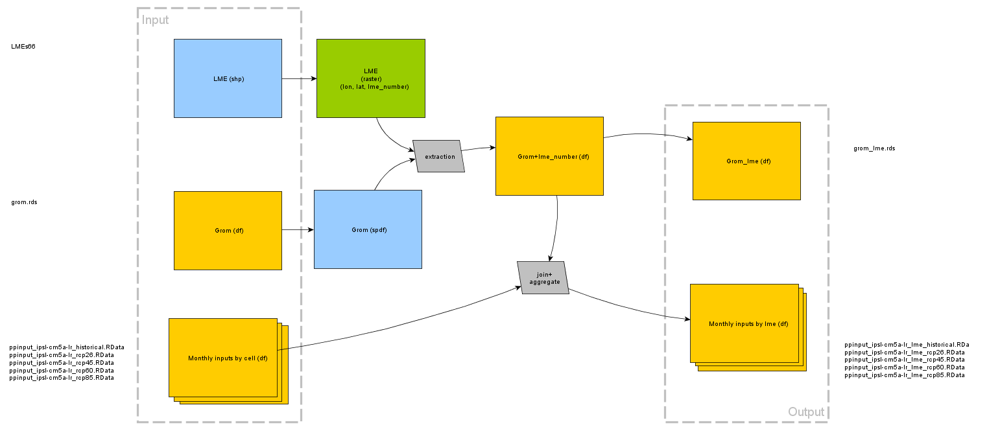

```{r setup, include=FALSE}
knitr::opts_chunk$set(echo = TRUE)
library(rgdal)
library(dplyr)
library(raster)
library(ggplot2)
```

## Steps

* use Grid Cell Ordinal Mapping `grom` and LME polygons, to map ocean-only gridIDs and their lon-lats to LME number.
* use lon-lat + lme_number to join to Monthly dbpm input files (historical and rcp scenarios)
* group by lme_number and month time step summarise by `mean()` all variables (`sphy`, `lphy`, `sst`, `sbt`, `er`, `intercept`, `slope`)
* produce output files (nominally "input files") in `fishmip_inputs/lme`

A diagram of the relationships between inputs and outputs is given in Figure 1.




### LME and raster LME

I created a 1° rasterised map of the Large Marine Ecosystems (LME) shape file with the value of the raster being the identfier LME_NUMBER.


```{r LME, echo=FALSE}
LMEs <- readOGR(dsn ="LMEs66/", layer = "LMEs66", verbose = FALSE)
r <- raster(ncol=360, nrow=180)
extent(r) <- extent(LMEs)
rLMEs <- rasterize(LMEs, r, 'LME_NUMBER')
crs(rLMEs) <- crs(LMEs) 
rm(r, LMEs)
```

A plot of the raster map of LME is given here

```{r plot rLMEs, echo=FALSE}

plot (rLMEs, axes=FALSE, frame.plot=TRUE, xlab="", ylab="", legend=F) #Mike how to quickly plot this using discrete distiguishable adjacent colors?

```


### GROM - GRid cell Ordinal Mapping

* make mapping (and/or find/develop language around ordinal gridcell numbering with or without the land omitted)

To enable easier mapping between spatial data and the ocean-only ordinal cell references by which the input files are referenced, I've made a mapping of gridnum to gridid. GridNum is the ordinal number of a cell in 1°x1° grid starting from Latitude -89.5 and Longitude 0.5, running through to 89.5, 359.5, with all land and ocean included. Gridnum ranges from 1 to 64800. GridId is the contiguous ordinal numbering of all 1°x1° grid cells that cover the ocean. GridID ranges from 1 to 39567.

I've made a Grid cell Ordinal mapping (or GROM) that maps GridId (as found in the filenames of DBPM inputs) to GridNum as is found in the 1-row-dataframe `depth` in each inputfile. To enable spatial analysis and potentially depth-related analysis I have included the `lat` and `lon` and `depth` attributes in the mapping. The mapping is available as a file `grom.rds` in this repository, as is the code by which it was generated (`gridcell_ordinal_mapping.R`). 

The code to produce grom is here:

```{r produce grom, eval=FALSE, echo=TRUE}
  filename_template <- "/rd/gem/private/fishmip_inputs/rds/rcp26/grid_%s_inputs2_ipsl-cm5a-lr_rcp26.rds"
  mylist = list()
  
  gridids <- 1:39567
  
  for (gridid in gridids) {
    dat <- readRDS(sprintf(filename_template, gridid))
  
    mylist[[gridid]] <- cbind(dat$depth[1,], gridid)
    
    rm(dat)
    
    }
  
  grom <- dplyr::bind_rows(mylist)
  
  saveRDS(grom, file = "grom.rds")

```

Here I re-use the preproduced GROM
```{r grom}
grom <- readRDS("grom.rds")

#Grom uses a positive 0-360° extent for longitudes. 
#to align with the -180°-180° extent of the LME shape I math transform lon
# should this be done with extent()?
grom$lon <- ifelse(grom$lon > 180, grom$lon -360, grom$lon)  

#a copy of grom will be spatialised to use in processing. Grom preserved for endresult
grom_sp <- grom
coordinates(grom_sp) <- ~lon+lat
```

A raster plot of grom looks like this

```{r plot grom_sp, echo=FALSE}

#rasterize for plot display
r <-raster(ncol=360, nrow=180)
# extent(r) <- extent(LMEs)
r <- rasterize(grom_sp, r, 1)
plot(r, col = "grey", axes=FALSE, frame.plot=TRUE, xlab="", ylab="", legend=F)

```

### GROM - LME Intersect

```{r grom lme intersect}
#use raster extract to get a vector of raster values for each point in grom
lme_number <- extract(rLMEs, grom_sp)

#bind LME vector to grom
grom <- cbind(grom, lme_number)

# rm(rLMEs, grom_sp, lme_number)

grom_lme <- grom %>%
  filter(!is.na(lme_number))
coordinates(grom_lme) <- ~lon+lat
#crs(grom_lme) <- crs(LMEs)

#rasterize for plot display
r_grom_lme <-raster(ncol=360, nrow=180)
# extent(r) <- extent(LMEs)
r_grom_lme <- rasterize(grom_lme, r_grom_lme, 'lme_number')
plot(r_grom_lme, axes=FALSE, frame.plot=TRUE, xlab="", ylab="", legend=F)

#move extent back from -180° - 180° to 0° - 360°, to align with original inputs (grom)
grom$lon <- ifelse(grom$lon<0, grom$lon + 360, grom$lon)
#saveRDS(grom, file="grom_lme.rds")

```

### Output file production

Use the monthly input files (historical, and rcp scenarios), and generated output filenames as per the code below. Used the Grom, enriched with the LME number (grom_lme.rds), to group by lme_number and t (monthly timestep). I produced the output of this process (nominally "LME scale DBPM inpute files") in the directory `fishmip_inputs/lme`.

Files have been produced as rds (not RData), progressing the transition to improved fileformat/data format use. 

```{r join history, eval=FALSE, echo=TRUE}

inputs <- c("ppinput_ipsl-cm5a-lr_historical.RData","ppinput_ipsl-cm5a-lr_rcp26.RData",
    "ppinput_ipsl-cm5a-lr_rcp45.RData","ppinput_ipsl-cm5a-lr_rcp60.RData",
    "ppinput_ipsl-cm5a-lr_rcp85.RData")
inputs <- paste0("/rd/gem/private/fishmip_inputs/", inputs)

outputs <- c("ppinput_ipsl-cm5a-lr_lme_historical.rds","ppinput_ipsl-cm5a-lr_lme_rcp26.rds",
    "ppinput_ipsl-cm5a-lr_lme_rcp45.rds","ppinput_ipsl-cm5a-lr_lme_rcp60.rds",
    "ppinput_ipsl-cm5a-lr_lme_rcp85.rds")
outputs <- paste0("/rd/gem/private/fishmip_inputs/lme/", outputs)


#load preproduced, LME enriched GROM
grom_lme <-  readRDS("grom_lme.rds") %>%
  filter(!is.na(lme_number))

for (i in 1:5) {
  #creates variable pp
  load(inputs[i])  

  #inner join pp to grom on lon and lat
  #select lme and t and variables
  pp_lme <- pp %>%
    inner_join(grom_lme, by=c("lon","lat"), copy=T) %>%
    dplyr::select(lme_number, t, sphy, lphy, sst, sbt, er, intercept, slope) %>%
    group_by(lme_number, t) %>%
    summarise_all(mean)  
  
  saveRDS (pp_lme, file=outputs[i])
}


```